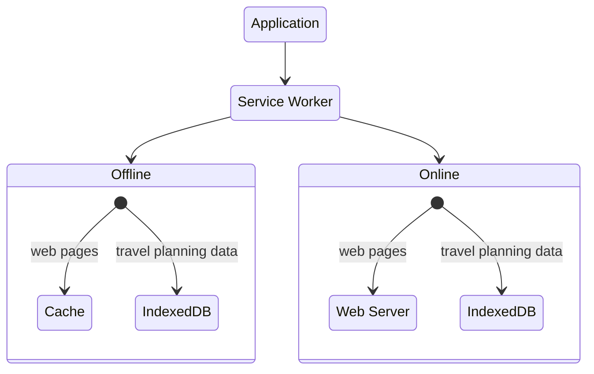
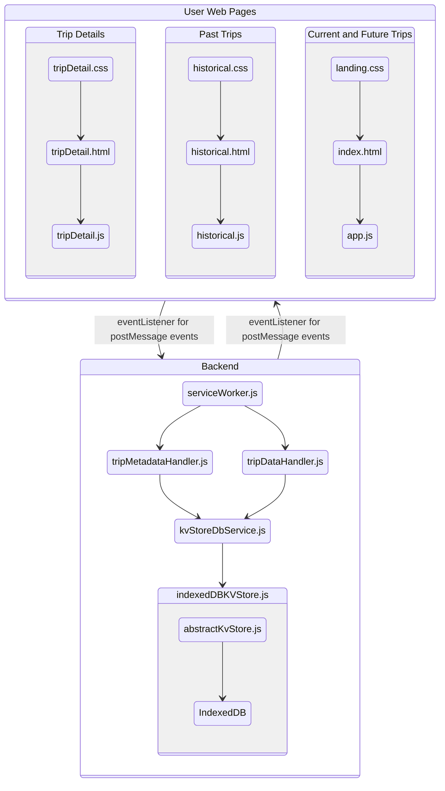
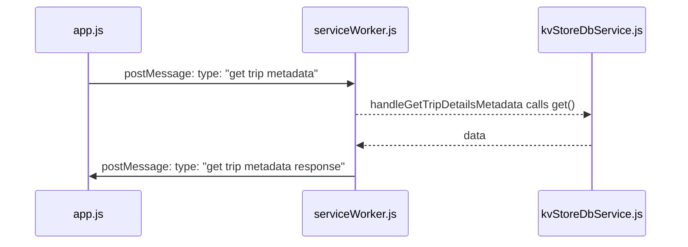
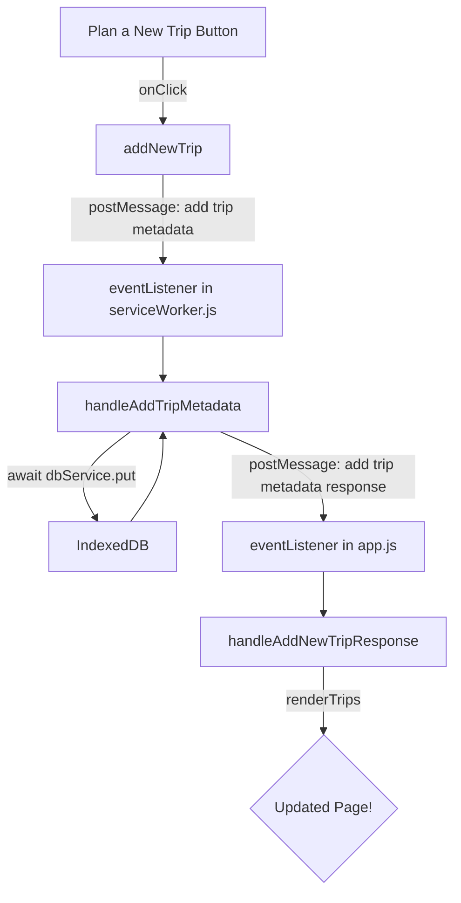
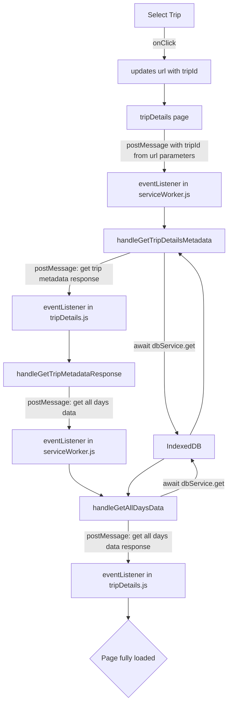

### Progressive Web Application Architecture

```mermaid
stateDiagram-v2
    WS: Web Server
    SW: Service Worker
    ID: IndexedDB
    Application --> SW
    SW --> Offline
    SW --> Online
    state Offline {
        [*] --> Cache: web pages
        [*] --> IndexedDB: travel planning data
    }
    state --> Online {
        [*] --> WS: web pages
        [*] --> ID: travel planning data
    }
```

---

### Application Pages Overview

```mermaid
stateDiagram-v2
    UP: User Web Pages
    tp: Trip Details
    pt: Past Trips
    home: Current and Future Trips
    UP --> Backend: eventListener for postMessage events
    Backend --> UP: eventListener for postMessage events
    state UP {
        state home {
            landing.css --> index.html
            index.html --> app.js
        }
        state pt {
            historical.css --> historical.html
            historical.html --> historical.js
        }
        state tp {
            tripDetail.css --> tripDetail.html
            tripDetail.html --> tripDetail.js
        }
    }
    state Backend {
        serviceWorker.js --> tripMetadataHandler.js
        serviceWorker.js --> tripDataHandler.js
          
        tripMetadataHandler.js --> kvStoreDbService.js
        tripDataHandler.js --> kvStoreDbService.js
        kvStoreDbService.js --> indexedDBKVStore.js
        state indexedDBKVStore.js {
            abstractKvStore.js --> IndexedDB
        }
    }
```

---

### Service Worker Communication

```mermaid
sequenceDiagram
    app.js->>serviceWorker.js: postMessage: type: "get trip metadata"
    serviceWorker.js-->>kvStoreDbService.js: handleGetTripDetailsMetadata calls get()
    kvStoreDbService.js-->>serviceWorker.js: data
    serviceWorker.js->>app.js: postMessage: type: "get trip metadata response"
```

---

### Create New Trip Flow

```mermaid
flowchart TB
    NT[Plan a New Trip Button]-- onClick -->a[addNewTrip]-- postMessage: add trip metadata -->EL[eventListener in serviceWorker.js]-->handleAddTripMetadata-- await dbService.put -->IndexedDB-->handleAddTripMetadata-- postMessage: add trip metadata response -->ELA[eventListener in app.js]-->ha[handleAddNewTripResponse]-- renderTrips -->UP{Updated Page!}
```

---

### Go to Trip Details Flow

```mermaid
flowchart TB
    T[Select Trip]-- onClick -->u[updates url with tripId] -->t[tripDetails page]-- postMessage with tripId from url parameters -->EL[eventListener in serviceWorker.js]-->handleGetTripDetailsMetadata-- await dbService.get -->IndexedDB-->handleGetTripDetailsMetadata-- postMessage: get trip metadata response -->ELA[eventListener in tripDetails.js]-->handleGetTripMetadataResponse-- postMessage: get all days data -->E[eventListener in serviceWorker.js]-->handleGetAllDaysData-- await dbService.get -->IndexedDB-->handleGetAllDaysData-- postMessage: get all days data response -->ELAA[eventListener in tripDetails.js]-->UP{Page fully loaded}
```
